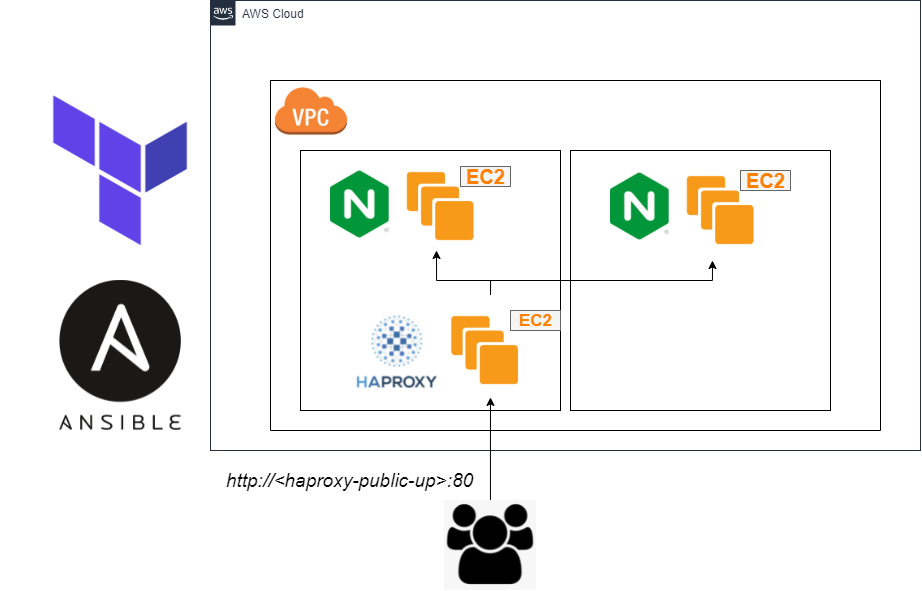

# Automating two-tier infrastructure provisioning through Ansible & Terraform

## Architecture Diagram


## Technology stack
AWS | Terraform | Ansible | Nginx | HAProxy
:-------------------------:|:-------------------------:|:-------------------------:|:-------------------------:|:-------------------------:
  |    |  |  |  
---
## Motivation
For most modern day applications, unpredictable user traffic can be managed by having multiple nodes to serve additional requests. In the case of a web application, we can have two or more web servers behind a load balancer which handles and distributes user requests from the public web. 

In this project, we explore deploying a simple webpage on two nginx web servers. Web requests are load balanced by a HAProxy node to ensure each web node isn't overworked. 

To deploy the application in a reliable and repeatable fashion, we automate the infrastructure provisioning with Terraform while Ansible handles the server set-up as well as installing dependencies. This way we have a phoenix server design with resilience to configuration drift. 

---
## Requirements
This guide assumes the user is running a WindowsOS with the following software installed and configured:

| Software  | Version |
| ------------- | ------------- |
| Git CLI  | >= 2.3 |
| Terraform  | >= 0.14 |
| AWS CLI | >= 2.0 (**with credentials configured**) |


For Git CLI installation, [this guide](https://git-scm.com/book/en/v2/Getting-Started-Installing-Git) will be helpful.

For Terraform, there are [various ways to install the binary on Windows](https://learn.hashicorp.com/tutorials/terraform/install-cli). For simplicity, you can download the updated zipped package and add the unzipped binary's path to your `PATH`.

For AWS CLI, you may follow this [guide to install AWS CLI](https://docs.aws.amazon.com/cli/latest/userguide/install-cliv2-windows.html) using the MSI installer.
<br><br>

---
## Set-up & Configurations
Before we're able to deploy our resources, there are some set-up steps required. These steps are not recommended to be automated as doing so may not conform to best practices from a security and reliability perspective.

### Creating a region-specific key pair on AWS console
On your favourite browser, [log in to your AWS account](https://aws.amazon.com/console/) and access the EC2 page. Since key pairs are region-specific, select the region you plan to deploy AWS resources at the top right hand corner. For the purpose of this demonstration, we are using ```US East (N. Virginia) us-east-1``` as the default region.

1. Select ```US East (N. Virginia) us-east-1``` as your region at top right corner.

2. Access the ```Key Pairs``` tab on the left-most pane under ```Network & Security```. 

3. Click ```Create Key Pair```. Give your key pair an acceptable name, select File Format as ```pem```, and proceed to create the key pair. This will create your Key Pair resource and automatically download the {your-key-pair-name}.pem file which we can use to attach to our EC2 instances for OpenSSH access. 

4. Copy ```{your-key-pair-name}.pem``` file to both the terraform folder as ```terraform/{your-key-pair-name}.pem``` and ansible folder as ```ansible/{your-key-pair-name}.pem```.

5. Edit the ```key_pair``` variable in ```terraform/terraform.tfvars``` file to your key pair name ```your-key-pair-name```.

You're all set!

> Note: Since key pairs are region-specific, trying to deploy your EC2 resources in a region without the configured key pair will fail.

<br>

---

## Infrastructure deployment

Using git bash, clone this repository and cd into the terraform folder.
```bash
git clone https://github.com/hideyukikanazawa/haproxy-nginx-deployment.git
cd haproxy-nginx-deployment/terraform
```

Run the terraform initialize command to initialize the working directory containing Terraform configuration files. It is safe to now run the plan command to view our infrastructure plan and check if there are any misconfigured resources. (Note: This doesn't provision anything yet)

Since we're using AWS as the provider, Terraform interacts with the AWS CLI and deploys the infrastructure with our configured AWS account. Run the terraform apply command to apply all changes and start up our defined cloud services. 
```bash
terraform init
terraform plan
terraform apply -auto-approve # Only run this when you're sure of provisioning infrastructure
```
Terraform will proceed to spin up our cloud resources using AWS CLI, 

---

## Pitfalls
1. There should be one public subnet and two private subnets. While the HAProxy resides in the public subnet for inbound public traffic, Web servers should be created in private subnets so as to not allow direct inbound web traffic. A NAT gateway/instance should be provisioned in the public subnet. Outbound web traffic required for the web servers for package and dependency installation should be routed to the NAT gateway/instance for internet access. 


2. Web server count should be dynamic. The current set-up allows for a static no. of 2 web servers to be provisioned. While traffic is load balanced, it would be more ideal to make the no. of web servers dynamic as a count variable to respond to varying peak capacities. 

3. AWS AMI should be dynamic and allow pulling of relevant Ubuntu v20 AMI image based on AWS region.

4. Ansible playbook should account for other OS as well (RHEL & CentOS) if required. 

<br>

---


## References

Dynamic inventory hosts: https://stackoverflow.com/questions/45489534/best-way-currently-to-create-an-ansible-inventory-from-terraform